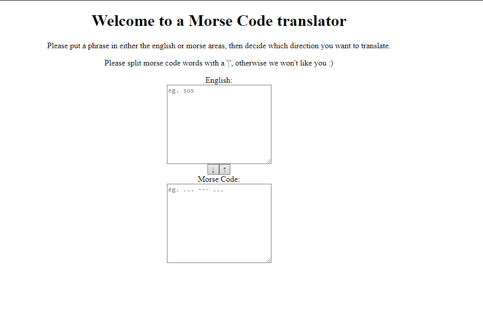

# Morse Code Translator

## Demo & Snippets

- Include hosted link
- 

---

## Requirements

- This task will require you to create a web page Morse Code translator. The User Interface will have to look good but should remain simple (additional features, ie. sounds, lights, etc, should only be added once the MVP has been completed.)
- Create a user interface that allows the user to either input some English text or some Morse Code

### MVP's

- Create JS functions that would allow the user to:

  - translate their English text into Morse Code
  - Morse Code into English text

- Make sure to add unit tests for your translating functions

- Make sure to handle spaces properly (ie. there is 1 space between English words, but one space between Morse Code characters)

---

## Build Steps

- Use live server extension to run project
- npm test to run the unit tests

---

## Design Goals / Approach

- The design goals was to make a basic UI, similar to Google Translate, specifically for English and Morsecode inputs. The core aspects of this project was implementing tests, showing my working knowledge of this.
- I followed a test-driven development process, which allowed me to better understand my JavaScript functions. By defining my tests and the edge-cases/unit tests, I could better break down what my functions should return. This allowed for a faster development, while adhering to my tests, and reducing the number of potential bugs.

---

## Features

- Ability to translate English to morse code, and vice versa
- Unit/Edge case tests

---

## Known issues

- When translating, doesn't clear the original input

---

## Future Goals

- Potentially changing this so that it auto-detects the language put in, and having an output box. This way, I can clear the original input and have the output box be "Hello → .... . .-.. .-.. ---", or something similar to this.

---

## Change logs

### 21/11/2023 - Input boxes fixed

- Changed initial value to be placeholder, not value
- Changed input box to be text area

---

## What did you struggle with?

- At first, I struggled with developing my javascript functions. I decided to switch to a test-driven development and this helped a lot. I could kind of work backwards for my functions, with my outputs being defined by my tests. This helped me, especially with what error messages I would throw.

---
